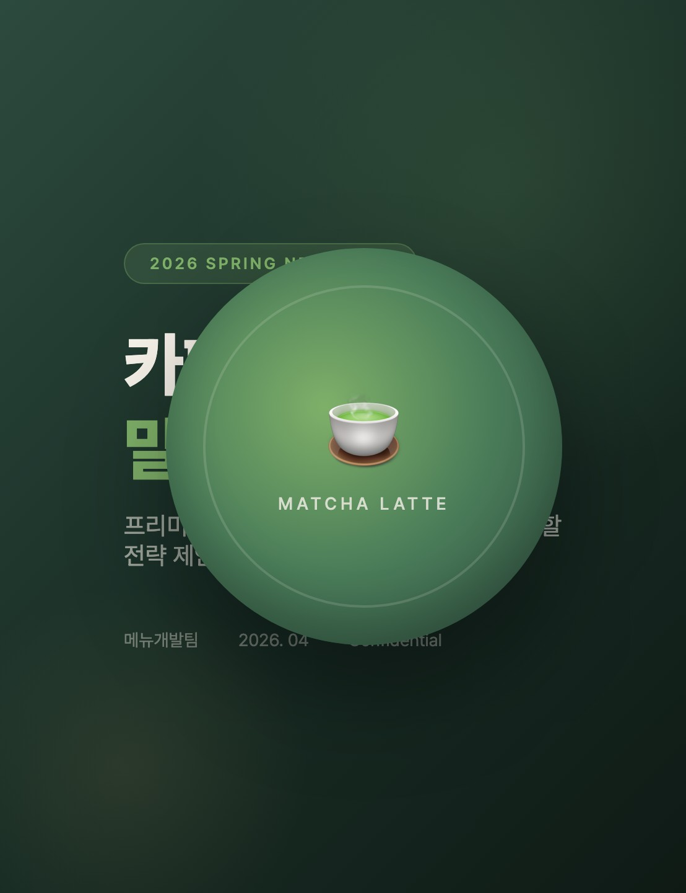
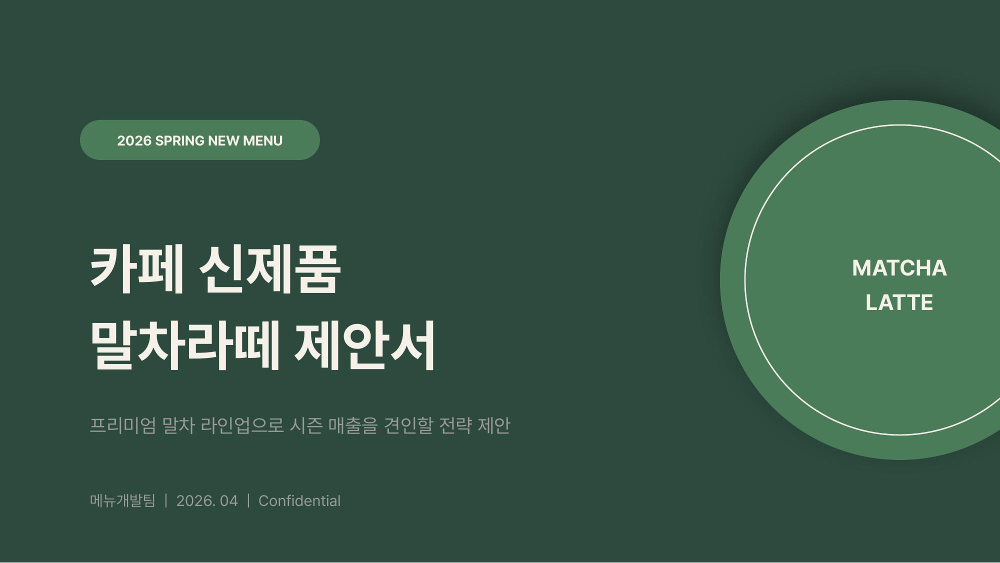

<div align="center">
    
</div>

# PPT Designer가 뭔가요?

디자인 토큰을 기반으로 HTML + PDF 프레젠테이션을 제작하는 Claude Code Skill입니다.
가볍게 고퀄리티의 제안서를 만들어보세요!

## 스킬 적용 전 vs 후

같은 프롬프트 `"카페 신제품 말차라떼 제안서 만들어줘"`로 생성한 결과 비교.

### HTML

| 스킬 없음 (Baseline) | 스킬 적용 (With Skill) |
|:--------------------:|:---------------------:|
|  |  |
| [baseline.html](examples/comparison/baseline/baseline.html) | [with-skill.html](examples/comparison/with-skill/with-skill.html) |

### PPTX

| 스킬 없음 (Baseline) | 스킬 적용 (With Skill) |
|:--------------------:|:---------------------:|
|  |  |
| [baseline.pptx](examples/comparison/baseline/baseline.pptx) | [with-skill.pptx](examples/comparison/with-skill/with-skill.pptx) |

> 직접 다운받아서 비교해보세요.

## 어떤 기능을 제공하나요?

디자인 토큰을 기반으로 한 프레젠테이션용 HTML과 PDF를 생성합니다.
HTML은 다음과 같은 기능을 지닙니다.

|  |  |
|:-----------------------------------------------------------------:|:-----------------------------------------------------------------------------:|
| 수정 | 프레젠테이션 모드 |

### 참고사항
- Skill로 순수 슬라이드 콘텐츠만 생성하고, 프레젠테이션/편집 기능은 외부 스크립트로 처리됩니다.
- PPTX도 지원하나 HTML 생성 후 수정하시는 것을 권장합니다.
  - HTML 기반 만족도 95%, PPTX 기반 만족도 75%

## 단축키 & 기능

### 수정

| 기능 | 단축키 | 설명 |
|:----:|:------:|:-----|
| 열기/닫기 | `E` 또는 버튼 클릭 | 스타일 편집 패널 토글 |
| 글로벌 탭 | — | CSS 커스텀 프로퍼티 컬러 편집 |
| 요소 탭 | 슬라이드 요소 클릭 | font-size, line-height, color, padding, margin 편집 |
| 텍스트 편집 | 요소 선택 후 textarea | 텍스트 내용 직접 수정 (줄바꿈 지원) |
| 이미지 크기 | 이미지 클릭 | width, height 슬라이더 조절 |
| 되돌리기 | `Ctrl+Z` / `⌘+Z` | 최대 100단계 |
| 임시 저장 | `Ctrl+S` / `⌘+S` | localStorage에 저장 (새로고침 유지) |
| HTML 다운로드 | 다운로드 버튼 | 수정 반영된 HTML 파일 저장 (에디터 UI 제거) |
| 도움말 | `ⓘ` 버튼 hover | 기능 안내 툴팁 |

### 프레젠테이션

| 기능 | 단축키 | 설명 |
|:----:|:------:|:-----|
| 시작 | `P` 또는 버튼 클릭 | 풀스크린 슬라이드쇼 시작 |
| 슬라이드 클릭 | 썸네일 클릭 | 해당 슬라이드부터 시작 |
| 다음 | `→` `↓` `Space` `Enter` | 다음 슬라이드 |
| 이전 | `←` `↑` | 이전 슬라이드 |
| 처음/끝 | `Home` / `End` | 첫/마지막 슬라이드 |
| 전체화면 | `F` | 브라우저 전체화면 토글 |
| 종료 | `ESC` 또는 닫기 버튼 | 프레젠테이션 종료 |
| 터치 | 좌우 스와이프 | 이전/다음 슬라이드 |
| 휠 | 마우스 휠 | 이전/다음 슬라이드 |

## 설치

```bash
# Claude Code 스킬 디렉토리에 복사
cp -r . ~/.claude/skills/ppt-designer/

# PDF 추출 의존성
pip install playwright Pillow
playwright install chromium
```

## 사용법

Claude Code에서:
```
"이 내용으로 PPT 만들어줘"
"전략제안서 발표자료 제작해줘"
"이 PDF 기반으로 presentation 만들어줘"
```

스킬이 자동 트리거되어:
1. 무드보드/레퍼런스 요청
2. 디자인 토큰 추출 + 확인
3. HTML 슬라이드 생성 + PDF 추출

## 파일 구조

```
ppt-designer/
├── SKILL.md                          # 메인 스킬 정의
├── references/
│   ├── korean-typography.md          # 한국어 타이포 규칙
│   ├── slide-layouts.md              # 레이아웃 좌표 패턴
│   ├── adr.md                        # Architecture Decision Records (18개)
│   ├── template-map.md              # 마스터 템플릿 매핑
│   ├── emoji-cdn.md                  # 3D 이모지 CDN 레퍼런스
│   └── emoji-index.json              # 3,054개 이모지 전체 인덱스
├── scripts/
│   ├── presenter.js                  # 프레젠테이션 모드 (자동 주입)
│   ├── editor.js                     # 스타일 편집기 (자동 주입)
│   └── export-pdf.py                 # HTML → 300 DPI PDF
└── examples/
    ├── startup-pitch/                # AI SaaS 피치덱 예시 (8장)
    └── comparison/                   # 스킬 적용 전/후 비교
```

## 아키텍처

### HTML은 순수 콘텐츠만

생성되는 HTML은 `.frames > .frame > .viewport > .slide` 구조의 슬라이드 콘텐츠만 포함.
모든 사이징은 `cqw` 단위 (container query width).

```html
<script src="scripts/presenter.js"></script>  <!-- 프레젠테이션 모드 -->
<script src="scripts/editor.js"></script>      <!-- 스타일 편집기 -->
```

### presenter.js

- "프레젠테이션" 버튼 → 풀스크린 오버레이
- 키보드: P 시작, → Space 다음, ← 이전, F 전체화면, ESC 종료
- 터치 스와이프 + 마우스 휠 지원
- 썸네일 클릭 → 해당 슬라이드부터 시작
- 자동 워터마크 (meta author + HTML comment)

### editor.js

- "수정" 버튼 → 스타일 편집 패널
- 글로벌 탭: CSS 커스텀 프로퍼티 컬러 편집
- 요소 탭: 클릭 → font-size, line-height, color, padding, margin, 텍스트 내용 편집
- 이미지: width/height 조절
- 되돌리기 (Ctrl+Z, 100단계) + 저장 (Ctrl+S, localStorage)
- HTML 다운로드 (에디터 UI 제거, 수정 반영)

### 에셋 (CDN)

- **3D 이모지**: `https://static.kid-o.cloud/ppt-designer/emoji/{category}--{name}.png` (3,054개)
- **Unsplash 사진**: URL 직접 사용 (핫링크 허용)
- 로컬 다운로드 없음 → HTML 하나로 자립

### PDF 추출

```bash
python3 scripts/export-pdf.py input.html output.pdf
```
Playwright 기반 2x 해상도 캡처 → 300 DPI PDF

## 디자인 규칙 (ADR 18개)

- 타이틀 accent bar 금지 — AI 슬라이드의 #1 특징
- 한국어 타이틀 22-26pt — 28pt+ 는 배너 광고
- 카드 최소화 — 플랫 레이아웃 + 디바이더 우선
- Fluent Emoji 3D — 시각적 풍성함
- 데이터 슬라이드에 장식 이미지 금지
- container-type 사용 시 viewport 높이 명시 필수

전체 목록: [references/adr.md](references/adr.md)

## 라이센스

MIT

Fluent Emoji: MIT License (Microsoft Corporation)
Unsplash Images: [Unsplash License](https://unsplash.com/license)
Pretendard Font: SIL Open Font License
